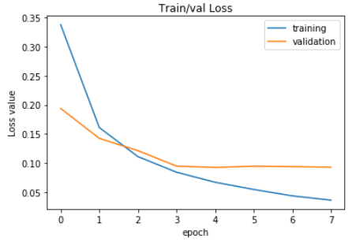
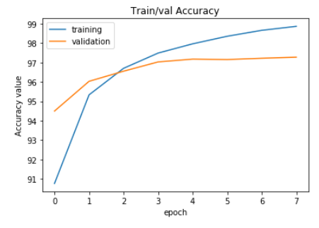

# Exercise 2b - MLP
For this exercise, we implemented the Multilayer Perceptron with one hidden layer.
We trained the network with 10, 50 and 100 neurons in the hidden layer as well as different learing rates, 0.001, 0.01 and 0.1.

## Best results
We end up with the following optimal parameters:
* Number of epochs = 7
* Number of neurons = 100
* Learning rate = 0.001
* Validation accuracy = 97.28%

Training and validation loss plot :

Training and validation accuracy plot :

## Final accuracy on test set
Accuracy on the test dataset = 97.45%
