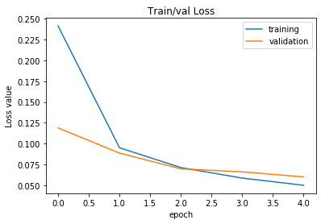
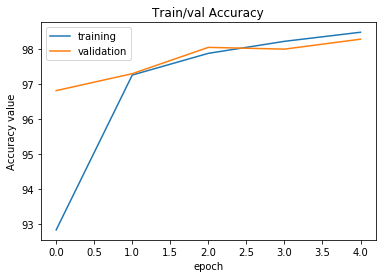

# Results of exercise 2c
## Hyperparameter used
* Input channel = 1
* Output channels = 24
* Kernel size = 9
* Stride = 3
* Padding = 1

## Best results
* Learning rate = 0.1
* Validation accuracy = 98.28%

Training and validation loss plot :

Training and validation accuracy plot :

## Final accuracy on test set
Accuracy on the test dataset = 98.27%
