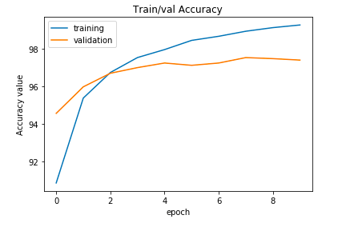
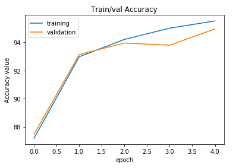
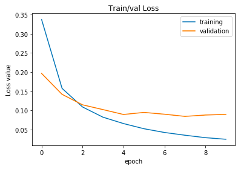
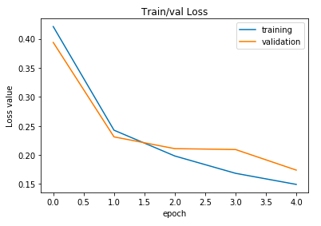
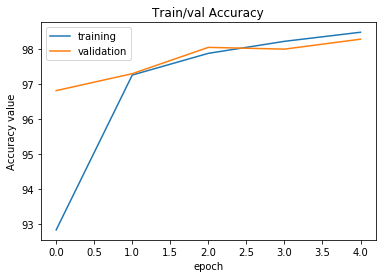
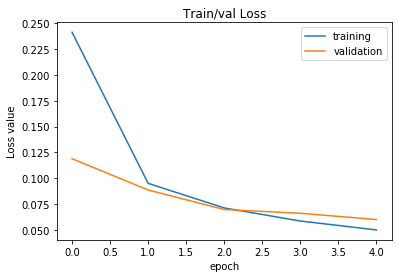

# Results of exercise 2d

## Comparing 2b and 2d: MLP Classifier

For exercise 2b we found that the optimal learning rate for the classifier was 0.001 and it lead to a validation accuracy of 97.39%.
In exercise 2d we utlized the same method on the permutated MNIST and found that the optimal learning rate was 0.001 and the validation accuracy was 95.34%.
* Our test set accuracy in **2b** was **97.45%**. 
* Our test set accuracy in **2d** was **95.93%**.

### Comparing the results from the plotted accuracy and loss:

* **Accuracy** : The accuracy for both 2b and 2d was similar in shape. There were no major peaks and troughs for the validation set. The validation set in 2b stabilized quickly whereas in 2d it increased a bit before stabilizing. Since only one hidden layer is utilized this could account for the non-complex accuracy curve.

* **Loss** : The loss curves mirror the accuracy found. We can observe that loss decreases as the number of epochs increase and this is what we would expect as we continue to train our system.

## Comparing 2c and 2d: CNN Classifier

For exercise 2c we found that the optimal learning rate for the classifier was 0.1 and it lead to a validation accuracy of 98.53%.
In exercise 2d we utlized the same method on the permutated MNIST and found that the optimal learning rate was 0.1 and the validation accuracy was 88.19%.
* Our test set accuracy in **2c** was **98.39%**. 
* Our test set accuracy in **2d** was **88.02%**.

### Comparing the results from the plotted accuracy and loss:

* **Accuracy** : In 2c our training and validation begin to follow the same trend after 1 epoch where we see they both peak before flattening out a bit. In 2d the training follows a similar pattern, however the validation set has greater variation. The permutated set has three filters unlike our set in 2c which had one filter. This could account for the variation in accuracy as well as the set being permutated and not as 'clean'. 

* **Loss** : Our loss curves follow a similar pattern. In 2c we have smoother curves and the validation has a tendency to follow the training set curve. In 2d we have greater variation for the validation curve. I believe this difference comes from the increase in the number of filters the images have. If we compare the pngs of the first dataset and second we can see the difference in how the images are presented.

## General Analysis

We can see that the accuracy are not as good with the permutated dataset as it was for the original one. This is certainly due to the fact that in this exercise we used PNG files as dataset which have more than one input channel (from black and white to RGB).

Moreover we can see that the accuracy dropped more for the CNN than for the MLP. This is due to the permutation : nothing changes for the MLP because the permuation is the same whereas the CNN recognition is based on certain patterns such as curves or angles, so with a permutated MNIST dataset, the CNN has more difficulty to give a good accuracy.
